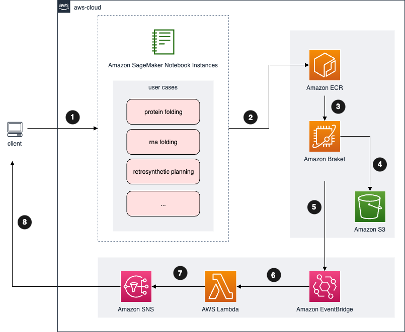

Deploying this solution with the default parameters builds the following environment in the AWS Cloud.

Figure 1: Solution architecture

This solution deploys the Amazon CloudFormation template in your 
AWS Cloud account and provides three parts:

- Notebook Experiment
- Batch Evaluation
- Visualization

**Notebook Experiment**

1. The solution deploys an instance for [AWS SageMaker Notebook](https://docs.aws.amazon.com/sagemaker/latest/dg/nbi.html), which allows **Notebook Experiment** for drug discovery(1).

2. The notebook comes with prepared sample code for different problems in drug discovery, such as molecular unfolding, molecule simulation and so on. You can learn how to study these problems based on classical computing or quantum computing through 
[Amazon Braket][braket]. For details, refer to [Workshop](workshop/background.md)(2).

3. The solution creates [NAT gateways][nat] in public [subnets][subnet], which connects to internet using an [internet gateway][internet-gateway]. The notebook instance is deployed in private subnets, which can access internet using NAT gateways(3).

**Batch Evaluation**

1. The solution deploys [AWS Step Functions][step-functions] workflows for **Batch Evaluation**(4). 

2. The AWS Step Functions workflows launches various computing tasks in parallel through [AWS Batch][batch] jobs based on different model parameters, resources, classical computing or quantum computing(5).

3. Each AWS Batch job uses the pre-built container image in [Amazon ECR][ecr](7) and attempts to evaluate a particular drug discovery problem based on specific model parameters(6). 

4. For classical computing, AWS Batch jobs evaluate the problem locally, and save results in [Amazon S3][s3](10).

5. For quantum computing, AWS Batch jobs asynchronously submit tasks to Amazon Braket as Braket tasks/jobs(9).

6. AWS Step Functions workflows waits for all jobs to complete.

7. When an Amazon Braket task/job completed, it saves output as a file in an Amazon S3 bucket, and an event is dispatched via [Amazon EventBridge][eventbridge](11).

8. An [AWS Lambda][lambda] function is triggered by events from EventBridge, and parses the output file of the Braket task/job in S3, saves the evaluation result to S3 bucket as well and sends a callback to the AWS Step Functions workflow.

9. When all sub jobs complete, AWS Step Functions workflow continues to the next step(12).

10. When the whole batch evaluation is done, the workflow sends a notification to [Amazon SNS][sns] topic. All [subscribers][subscribe-topic] will be notified for the batch evaluation result(13).

**Visualization**

1. An [Amazon Athena][athena] table is created for querying the metrics of batch evaluation(14).

2. You can view the **Batch Evaluation** results through [Amazon QuickSight][quicksight](15).

Remarks: 

- All computing resources (AWS Batch Compute Environment and AWS Lambda) are placed in private subnets in [Amazon VPC][vpc].

- [VPC Endpoints][vpc-endpoints] are enabled for Amazon ECR, Amazon S3, Amazon Athena and Amazon Braket(8).

[nat]: https://docs.aws.amazon.com/vpc/latest/userguide/vpc-nat-gateway.html
[subnet]: https://docs.aws.amazon.com/vpc/latest/userguide/VPC_Subnets.html
[internet-gateway]: https://docs.aws.amazon.com/vpc/latest/userguide/VPC_Internet_Gateway.html
[vpc]: https://docs.aws.amazon.com/vpc/latest/userguide/what-is-amazon-vpc.html
[athena]: https://docs.aws.amazon.com/athena/latest/ug/what-is.html
[gule]: https://aws.amazon.com/glue/getting-started/
[lambda]: https://aws.amazon.com/lambda
[sns]: https://aws.amazon.com/sns/
[s3]: https://aws.amazon.com/s3/
[batch]: https://aws.amazon.com/batch/
[eventbridge]: https://aws.amazon.com/eventbridge/
[quicksight]: https://aws.amazon.com/quicksight/
[ecr]: https://aws.amazon.com/ecr/
[braket]: https://aws.amazon.com/braket/
[step-functions]: https://aws.amazon.com/step-functions/
[vpc-endpoints]: https://docs.aws.amazon.com/vpc/latest/privatelink/vpc-endpoints.html
[subscribe-topic]: ./deployment.md
