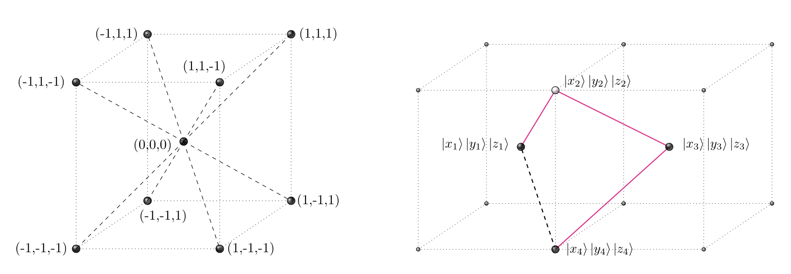

## Notebook experimentation

This notebook implements the [Quantum Speedup for Protein Structure Prediction](https://ieeexplore.ieee.org/document/9374469)
in
Amazon Braket. This is mainly contributed by [Renata Wong](https://scholar.google.com/citations?user=XVFoBw4AAAAJ&hl=en) and [Weng-Long Chang](https://ieeexplore.ieee.org/author/37273919400).

## Protein folding using Grover's search

Protein folding is the process by which a protein molecule assumes its three-dimensional shape, which is essential for its proper function. Proteins are made up of a linear chain of amino acids, and their final structure is determined by the sequence of amino acids and the interactions between them.

During protein folding, the linear chain of amino acids folds into a unique three-dimensional structure, which is stabilized by various types of interactions, such as hydrogen bonds, electrostatic forces, and van der Waals forces. The process of protein folding is highly complex and involves multiple stages, including the formation of secondary structures, such as alpha-helices and beta-sheets, and the packing of these structures into a final three-dimensional shape.

Figure 13: Protein before and after folding[10](#wiki-protein)

In this work, a fast quantum algorithm based on 
Grover's search is proposed. The protein structure
prediction problem is studied in 
three-dimensional hydrophobic-hydrophilic model on body-centered cubic lattice. 
The results show the quadratic speedup 
over its classical counterparts.

Figure 14: Body-centered cubic lattice[11]

Grover's algorithm is a quantum algorithm that 
can be used to search an unsorted database of 
N items in O(sqrt(N)) time. This is a 
significant speedup compared to 
classical algorithms, which require O(N) time to search an unsorted database.

## Notebook overview

1. Sign in to the [AWS CloudFormation console](https://console.aws.amazon.com/cloudformation/home?). 
2. On the **Stacks** page, select the solution’s root stack. 
3. Choose the **Outputs** tab and open the link for your notebook.

    

    Figure 15: Notebook URL on the stack's Output tab

4. Open
**healthcare-and-life-sciences/c-2-protein-folding-grover-search/protein-folding-gs.ipynb** and choose the kernel
**qc_hcls_protein_folding_gs**.

# References

- 10.[Wiki: Protein](https://en.wikipedia.org/wiki/Protein_folding)

- 11.[QFold: Quantum Walks and Deep Learning to Solve Protein Folding](https://iopscience.iop.org/article/10.1088/2058-9565/ac4f2f)