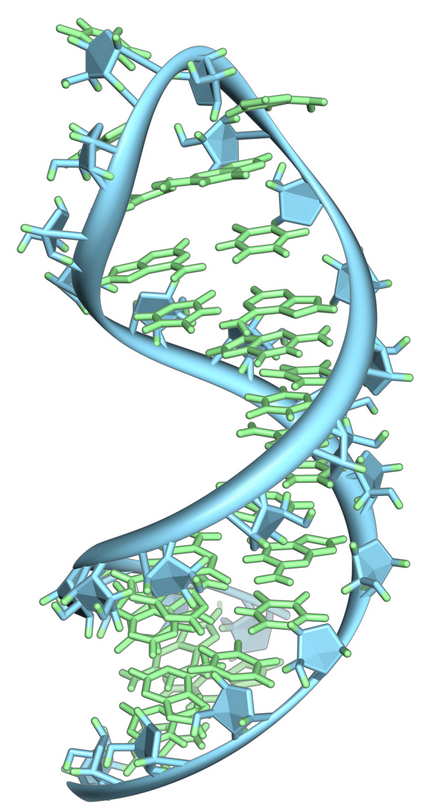

## 笔记本实验

This notebook implements the work from [RNA Folding Using Quantum Computers](https://journals.plos.org/ploscompbiol/article?id=10.1371/journal.pcbi.1010032) inspired by the work from [QHack 2022 Winner](https://github.com/XanaduAI/QHack2022/issues/114).

本笔记本实现了 [使用量子计算机进行 RNA 折叠](https://journals.plos.org/ploscompbiol/article?id=10.1371/journal.pcbi.1010032) 的工作，灵感来自 [QHack 2022 Winner](https://journals.plos.org/ploscompbiol/article? //github.com/XanaduAI/QHack2022/issues/114）。

## RNA折叠

RNA折叠是指单链RNA分子通过形成分子内碱基对而采用特定的三维结构的过程。这个过程对于RNA在各种生物过程中的正常功能至关重要，例如基因表达、RNA剪接和蛋白质合成。

图8: 来自pre-mRNA的发夹环[7](#wiki-rna)

在这项工作中，量子退火被用来预测 RNA 的二级结构。
为了引导系统最大化碱基对的数量和茎的平均长度，
哈密​​顿量以二元二次模型 (BQM) 格式制定。

## 笔记本概览

1. 登录 [AWS CloudFormation 控制台](https://console.aws.amazon.com/cloudformation/home?)。
2. 在 **Stacks** 页面上，选择解决方案的根堆栈。
3. 选择 **Outputs** 选项卡并打开笔记本的链接。

    

    图 7：堆栈输出选项卡上的笔记本 URL

4. 打开**healthcare-and-life-sciences/a-1-molecular-unfolding-quadratic-unconstrained-binary-optimization/molecular-unfolding-qubo.ipynb**目录下的文件，选择内核**qc_hcls_molecular_unfolding_qubo**。

4. 打开
**healthcare-and-life-sciences/b-1-rna-folding-quadratic-unconstrained-binary-optimization/rna-folding-qubo.ipynb**并选择内核
**qc_hcls_rna_folding_qubo**。

# 参考

- 7.[Wiki: RNA](https://en.wikipedia.org/wiki/RNA)